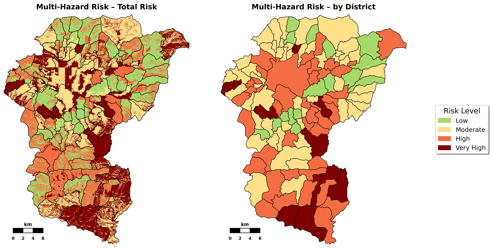

# Analysis of the multi-hazard risk in the Kathmandu Valley

* A GIS analysis was conducted, and the Kathmandu Valley was used as a sample study area. This encompasses the region surrounding the Nepalese capital, Kathmandu, and is a suitable example, as this region has been severely affected by the three natural hazards studied: floods, landslides, and earthquakes.

## Getting started

* The code is entirely contained in a Jupyter notebook and was developed with Python in VS Code. The working environment is managed with the [Miniforge](https://github.com/conda-forge/miniforge) distribution using **mamba/conda**, and the complete environment configuration is provided as a `.yaml` file in this repository for easy reproducibility.

### Dependencies

Before running the notebook, you need to have:
- Python 3.11.*
- [Miniforge](https://github.com/conda-forge/miniforge), Anaconda/Miniconda or other preferred environment
- JupyterLab or Jupyter Notebook
- The required packages listed in the `environment.yaml`

### Installing and executing programm

After following the steps of installing the miniforge dsitribution
1. Create the environment from the provided `.yaml` file:
    ```
    [mamba or conda] env create -f environment.yaml
    ```
2.  Activate the environment:
    ```
    [mamba or conda] activate Risk_analysis
    ```
3. Open the Jupyter Notebook in VS Code or JupyterLaband select right kernel (Risk_analysis) and run all cells

## Result

The following shows the endresult of the analysis:



## Data source and license

**Dataset:** 
* [Landslide susceptibility and exposure in Nepal](https://zenodo.org/records/8307964)
* [Seismic risk in Nepal](https://maps.meteor-project.org/map/eq-pga-npl/#7/28.387/84.135)

**License from Dataset Landslide:** [](https://creativecommons.org/licenses/by/4.0/legalcode)


## References

* Kincey, Mark; Rosser, Nick; Swirad, Zuzanna; Robinson, Tom; Shrestha, Ram; Singh-Pujara, Dammar
et al. (2023): National-scale rainfall-triggered landslide susceptibility and exposure in Nepal.

* Stevens, V. L.; Shrestha, S. N.; Maharjan, D. K. (2018): Probabilistic Seismic Hazard Assessment of
Nepal. In: Bulletin of the Seismological Society of America 108 (6), S. 3488–3510. DOI:
10.1785/0120180022.